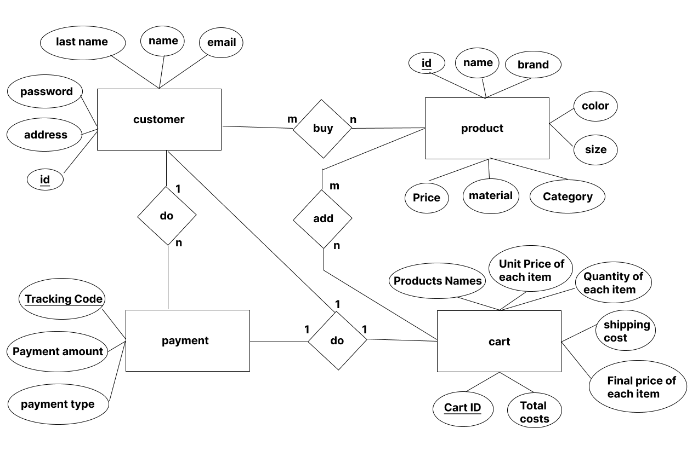

# clothing-store-website

## ER Diagram

## Initial setup
1- Install XAMPP and start apache and mysql services. 
2- Open the browser and enter the address http://localhost/phpmyadmin/ 
3- Click on the user accounts and then click on the add user account on the opened page. 
4- In the opened page, we must enter the username and password according to the process.php file, respectively, star and shopmestar, then we must tick the Create database with same option so that the created database is the same as the user name and the required access permission give this user. now we click on the go option at the bottom of the page. 
5- Click on the created database named star and then click on the sql tab and paste the contents of the shop_moh.sql file in the project file in this section and click on the go option to create the products and users tables in it. 
6- The website is ready to provide services, now you can enter the site by entering the following address. 
Address: http://localhost/star/main.html 
